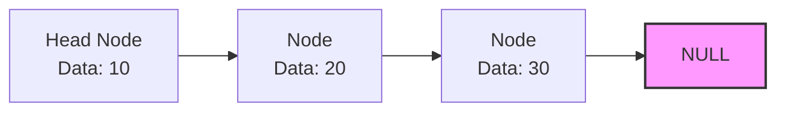

# Walkthrough: Linear Data Structures

Linear data structures organize elements in a sequential manner.

## 1. Sequential Representation (Arrays)
Elements are stored in contiguous memory locations.

```text
Memory Addresses:  [0x100] [0x104] [0x108] [0x10C]
Array Elements:    [  10 ] [  20 ] [  30 ] [  40 ]
Indexes:              0       1       2       3
```
* **Pros:** $O(1)$ constant time access.
* **Cons:** Fixed size, insertion/deletion is slow $O(N)$ due to shifting.

## 2. Linked Representation (Linked Lists)
Nodes are scattered in memory, connected via pointers.


* **Pros:** Dynamic size, fast insertion/deletion $O(1)$ if the target pointer is known.
* **Cons:** Access is slow $O(N)$ because you must traverse from the head. Extra memory needed for pointers.

## Types of Linked Lists:
* **Singly Linked List (SLL):** Nodes point only to the next node.
* **Doubly Linked List (DLL):** Nodes point to both previous and next nodes.
* **Circular Linked List (CLL):** The last node points back to the first node.

## Derived Linear Structures:
* **Stack:** LIFO (Last In, First Out). Think of a stack of plates.
* **Queue:** FIFO (First In, First Out). Think of a line at a ticket counter.
* **Dequeue:** Double Ended Queue. Insertion and deletion can happen at both ends.
