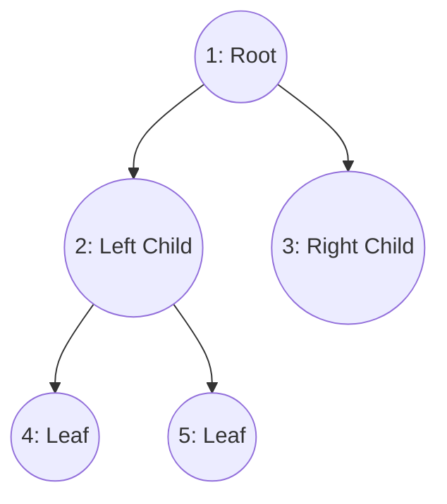
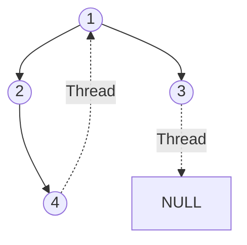

# Walkthrough: Non-Linear Data Structures (Trees)

Unlike arrays or linked lists, trees are non-linear and hierarchical. Data is structured like a family tree.

## Terminologies
* **Root:** The topmost node.
* **Edge:** The connection between one node and another.
* **Leaf:** A node with no children.
* **Depth/Level:** Distance from the root.
* **Height:** Longest path from the node to a leaf.

## Binary Tree
A tree where each node has at most 2 children (Left and Right).

### Traversals
Since it's non-linear, we can't just read it left-to-right. We use traversals (often implemented recursively):
1. **Inorder (Left, Root, Right):** Visits nodes in ascending order (if it's a BST).
2. **Preorder (Root, Left, Right):** Used to create a copy of the tree.
3. **Postorder (Left, Right, Root):** Used to delete a tree.

## Threaded Binary Tree
In a standard Binary Tree, leaf nodes have `NULL` pointers. This wastes space.
A **Threaded Binary Tree** replaces these `NULL` pointers with "threads" that point to the node's Inorder Predecessor or Successor. 

This makes Inorder traversal extremely fast without using a Stack or Recursion!

## Expression Tree
A binary tree used to represent algebraic expressions.
* Leaves = Operands (e.g., `A, B, 3, 4`)
* Internal Nodes = Operators (e.g., `+, -, *, /`)
Evaluating the tree via Postorder traversal gives the result of the expression.
