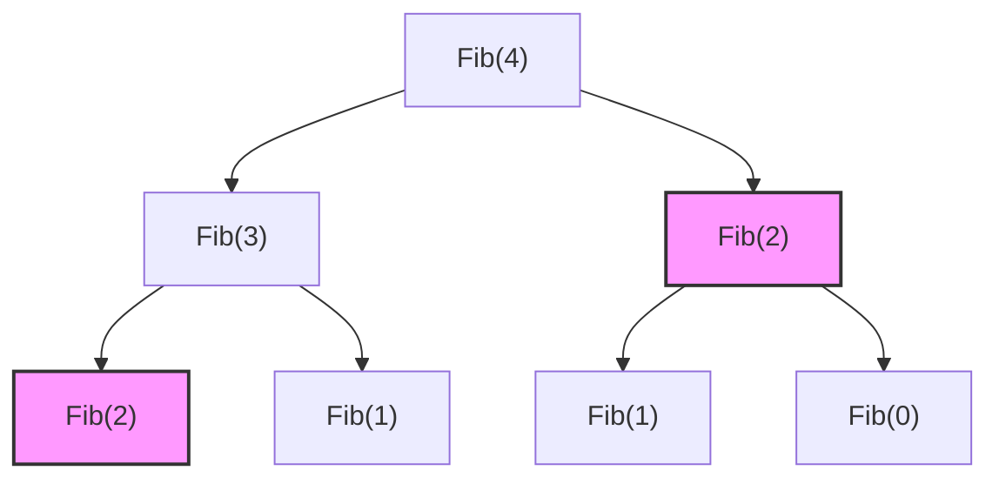

# Walkthrough: Dynamic Programming (DP)

Dynamic Programming is an optimization technique used to solve complex problems by breaking them down into simpler, overlapping subproblems. 

If a problem has:
1. **Optimal Substructure:** The optimal solution to the main problem is composed of optimal solutions to its subproblems.
2. **Overlapping Subproblems:** The same subproblems are solved multiple times.

...then DP is the perfect tool! It avoids redundant calculations by saving previously computed answers.

## Overlapping Subproblems (The Fibonacci Example)

Notice how in a pure recursive solution, `Fib(2)` is calculated completely independently twice. DP intercepts this and saves the value.

## The Two Approaches

### 1. Top-Down (Memoization)
You write the solution recursively, but before calculating a recursive call, you check if the answer is already in your "memo" (usually an array or hash map). If yes, return it. If no, calculate and save it.

### 2. Bottom-Up (Tabulation)
You completely drop recursion. You start with the smallest base cases (e.g., `dp[0]` and `dp[1]`) and iteratively build up to the answer `dp[n]` using a loop and a DP table/array.

## Classic Problems
* Fibonacci Sequence (1D DP)
* 0/1 Knapsack Problem (2D DP)
* Longest Common Subsequence (2D DP)
