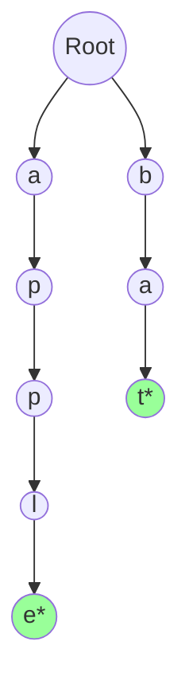

# Walkthrough: Advanced Data Structures

Once you've mastered Arrays, Trees, and Hash Maps, you can combine their properties to create highly specialized data structures.

## 1. Trie (Prefix Tree)
A specialized tree used exclusively for strings. 
* Unlike a BST where each node stores a full string, in a Trie, each node stores a **single character**.
* The path from the root to a node represents a prefix or a complete word.

* **Why use it?** It is heavily used in **Autocomplete**, **Spell Checkers**, and **IP Routing**. Searching for a string of length $L$ takes exactly $O(L)$ time, regardless of how many millions of words are stored in the Trie!

## 2. Disjoint Set Union (Union-Find)
A forest (collection of trees) data structure that tracks a set of elements partitioned into a number of disjoint (non-overlapping) subsets.
* **Find:** Determine which subset a particular element is in (often returning the "root" representative of that subset).
* **Union:** Join two subsets into a single subset.
* **Why use it?** It's the absolute fastest way to detect cycles in an undirected graph and is the core engine behind **Kruskal's Minimum Spanning Tree Algorithm**. With "Path Compression" and "Union by Rank", operations take near $O(1)$ amortized time.
